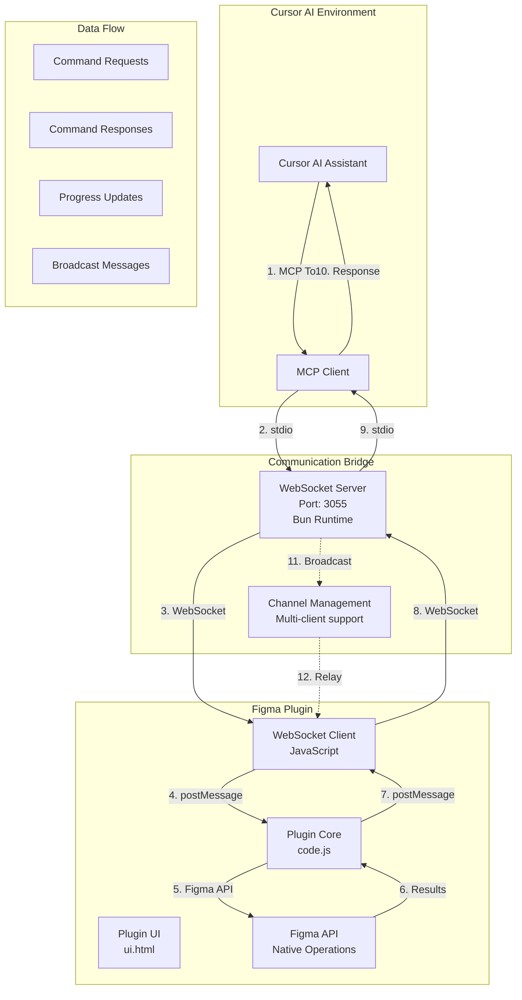

# Cursor Talk to Figma MCP - Communication Architecture Diagram

## Overview
This project implements a Model Context Protocol (MCP) bridge between Cursor AI and Figma, enabling AI-driven design operations through a multi-layered communication architecture.

## Architecture Components



## Communication Flow Details

### 1. Initialization Phase
```
Cursor AI → MCP Server → WebSocket Server → Figma Plugin → Figma API
     ↓              ↓                   ↓              ↓
  Tool Call    Protocol Handshake    UI Display     Ready State
```

### 2. Command Execution Flow
```
1. AI invokes MCP tool (e.g., create_rectangle)
2. MCP Server sends command via stdio to WebSocket Server
3. WebSocket Server routes to correct channel
4. Figma Plugin receives via WebSocket
5. Plugin UI forwards to plugin core
6. Plugin core executes Figma API operations
7. Results flow back through same path
```

### 3. Progress Tracking
```
Plugin Core → Progress Updates → UI → WebSocket → Server → MCP → AI
     ↓              ↓              ↓          ↓          ↓
  Operation    Visual Feedback   Real-time    Status     User
  Status        Progress Bar    Updates       Tracking    Visibility
```

## Key Communication Protocols

### MCP Protocol (Cursor ↔ Server)
- **Transport**: stdio (Standard Input/Output)
- **Format**: JSON-RPC 2.0
- **Tools**: 40+ Figma operations
- **Features**: Progress tracking, error handling, batch operations

### WebSocket Protocol (Server ↔ Plugin)
- **Transport**: WebSocket (ws://localhost:3055)
- **Message Types**:
  - `join`: Channel subscription
  - `message`: Command execution
  - `broadcast`: Multi-client messaging
  - `progress_update`: Real-time progress
- **Channel System**: Isolated communication channels

### Figma Plugin Protocol (UI ↔ Core)
- **Transport**: postMessage API
- **Message Types**:
  - `execute-command`: Command execution
  - `command-result`: Success response
  - `command-error`: Error response
  - `command_progress`: Progress updates

## Data Structures

### Command Request Format
```json
{
  "id": "uuid",
  "type": "message",
  "channel": "channel_name",
  "message": {
    "id": "uuid",
    "command": "create_rectangle",
    "params": {
      "x": 100,
      "y": 100,
      "width": 200,
      "height": 150
    }
  }
}
```

### Progress Update Format
```json
{
  "type": "command_progress",
  "commandId": "uuid",
  "commandType": "scan_text_nodes",
  "status": "in_progress",
  "progress": 65,
  "totalItems": 100,
  "processedItems": 65,
  "message": "Processing chunk 3/5",
  "timestamp": 1700000000000
}
```

## Component Interactions

### WebSocket Server (src/socket.ts)
- **Role**: Central communication hub
- **Capabilities**:
  - Multi-client channel management
  - Message routing and broadcasting
  - Connection lifecycle management
  - CORS support for cross-origin requests

### MCP Server (src/talk_to_figma_mcp/server.ts)
- **Role**: MCP protocol implementation
- **Capabilities**:
  - 40+ Figma operation tools
  - Request/response correlation with UUIDs
  - Progress tracking with chunking
  - Error handling and timeouts
  - Connection management

### Figma Plugin (src/cursor_mcp_plugin/)
- **UI Layer (ui.html)**:
  - WebSocket client management
  - Connection status display
  - Progress visualization
  - User interface controls

- **Core Layer (code.js)**:
  - Figma API operations
  - Command execution engine
  - Progress reporting
  - Batch processing with chunking
  - Error handling

## Advanced Features

### Chunked Processing
- Large operations split into manageable chunks
- Progress reporting for each chunk
- Prevents UI freezing and timeouts
- Example: `scan_text_nodes` with 10-node chunks

### Channel Isolation
- Multiple Cursor instances can work simultaneously
- Each session gets unique channel
- Prevents command interference
- Supports collaborative workflows

### Progress Tracking
- Real-time operation visibility
- Percentage-based progress
- Chunk-level reporting
- Error state handling

### Error Propagation
- Multi-layer error handling
- Detailed error context
- Graceful degradation
- User-friendly error messages

## Security Considerations

### Connection Security
- Localhost-only WebSocket connections
- CORS configuration for browser access
- Channel-based isolation
- No external network exposure

### Data Validation
- Parameter validation at each layer
- Type checking for Figma API calls
- Safe error handling
- Input sanitization

## Performance Optimizations

### Batch Operations
- `set_multiple_text_contents`: Process 5 nodes in parallel
- `set_multiple_annotations`: Batch apply annotations
- `delete_multiple_nodes`: Chunked deletions
- Parallel async processing

### Memory Management
- Chunked processing for large datasets
- Progress callback cleanup
- Connection pooling
- Resource cleanup on disconnect

### UI Responsiveness
- Non-blocking operations
- Progress visualization
- Timeout handling
- Connection state management

## Usage Example

### Creating a Rectangle
```bash
# AI calls MCP tool
create_rectangle({
  x: 100, 
  y: 100, 
  width: 200, 
  height: 150, 
  name: "My Rectangle"
})

# Flow:
# Cursor → MCP → WebSocket → Plugin → Figma API → Success
```

### Scanning Text Nodes
```bash
# AI calls with chunking
scan_text_nodes({
  nodeId: "frame_id",
  useChunking: true,
  chunkSize: 10
})

# Real-time progress updates shown in UI
# Results streamed back in chunks
```

